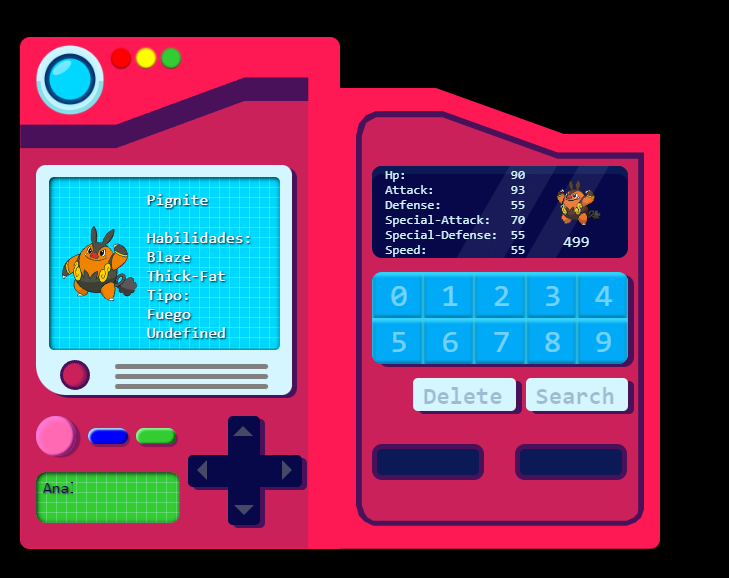

# Pokedex
Pokédex, una enciclopedia virtual interactiva traída del mundo Pokémon.

¿Una computadora dentro de otra?
¡Sí!, Justo esa es la sensación que buscaba al desarrollar esta Pokédex virtual,
aunque no soy muy fan del mundo Pokémon, este es un proyecto para afianzar y mejorar mis habilidades en:

| Destacado CSS | Destacado JS|
|----------------------------------|
| counters | fetch |
| clip-path | async |
| pseudo-elementos| await |