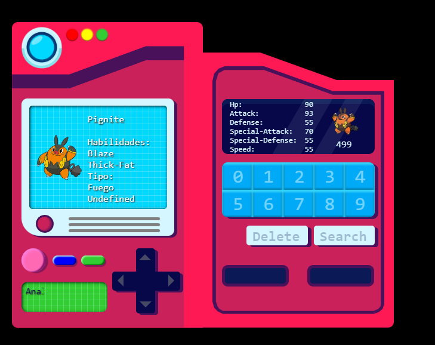

# 🧩 Pokedex

An interactive virtual **Pokédex** inspired by the Pokémon universe — designed to feel like a computer inside another computer.

🔗 **Live Demo:** https://cristianbyte.github.io/pokedex/

---

## 🚀 About

This project recreates a nostalgic Pokédex interface with a focus on UI/UX and frontend logic.

Even though I'm not deeply into Pokémon, I built this to push my frontend skills and experiment with creative interfaces.

---

## 🧠 What I Practiced

### 🎨 CSS
- counters  
- clip-path  
- pseudo-elements  

### ⚙️ JavaScript
- fetch  
- async / await  
- API integration  

---

## 📦 Tech Stack

- HTML5  
- CSS3  
- JavaScript  

---

## 💡 Notes

Built as part of my learning process — focusing on real UI experimentation and continuous improvement.

---
